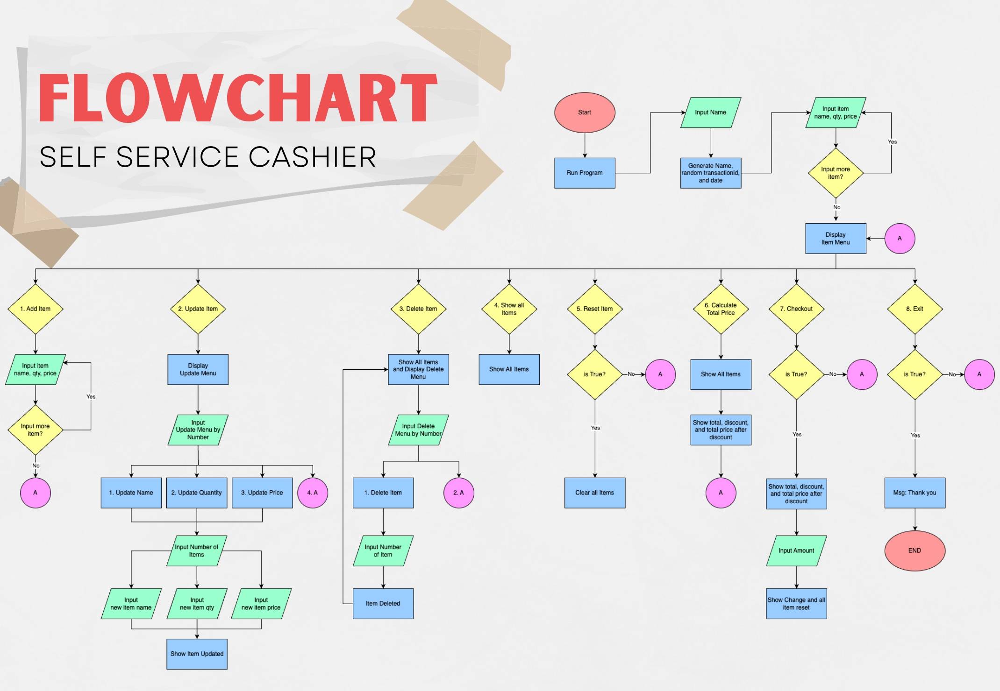
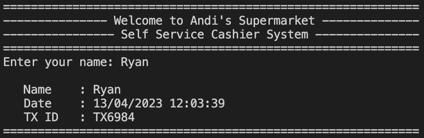

# Self-Service Cashier
This is a cashier system program that allows customers to add, update, delete, show, and checkout items, calculate total price, and exit the program. The program utilizes various functions for each option in the menu and can handle exceptions when the user inputs incorrect values. The program also generates a unique transaction ID for each customer.

<div align="center">
  
</div>
<div align="center">
  Image from <a href="https://www.naveocommerce.com/scan-and-go-vs-self-checkout/">NaveoCommerce</a>
</div>

## Problem Description
Andi is a large supermarket owner in one of the cities in Indonesia. Andi plans to improve the business process by creating a self-service system in his supermarket. This way, customers can directly input the items, quantity, and price of the items they purchased, and other features. This will enable customers who are not in the city to buy goods from the supermarket. 

After conducting research, Andi encountered a problem, which is that he needs a programmer to create features that will allow the self-service system in the supermarket to run smoothly.

## Requirements/Objectives
To fulfill request, here are some objective I decided the program works:
## Technical
1. Create a simple Cashier using Python Language.
2. Apply OOP and modularization.
3. Apply PEP8 principles to write clean Python Program.
4. Use Try-Exception
5. Write documentation for each function.
## Business
1. User input Username and get random Transaction ID
2. User has some features:
    * Add item: Allows customers to add items to the cart.
    * Update item: Allows customers to update the name, price, or quantity of an existing item.
    * Delete item: Allows customers to remove an item from the list of available products.
    * Show all items: Displays the list of available products.
    * Reset items: Resets the list of available products to the default state.
    * Calculate total price: Calculates the total price of all items with discount f the total price reach certain value:
        * 10% discount if total price > Rp 500.000
        * 8% discount if total price > Rp 300.000
        * 5% discount if total price > Rp 200.000
    * Checkout: Allows customers to checkout and input the amount then get change

## Flowchart


## Program Function Description
This project has 8 file based on Objective Above.
  1. `main.py` Contains the code for a cashier system program that allows customers to add, update, delete, show, and checkout items, calculate total price, and exit the program. The program utilizes various functions for each option in the menu and can handle exceptions when the user inputs incorrect values. It also generates a unique transaction ID for each customer.

  2. `add.py` Allows the user to add a new item to the shopping list.
  
| **Name**   | **Type** | **Input**                              | **Output** | **Description**                                                                                                                                  |
|------------|----------|----------------------------------------|------------|--------------------------------------------------------------------------------------------------------------------------------------------------|
| add_item() | Function | item name: str, item quantity: int, item price: int|            | The user is prompted to enter the name quantity and price of the item and the item is then added to the list with an auto-generated item number. |
  3. `check.py` Displays the items in the shopping list as a table.

 **Name**       | **Type** | **Input** | **Output** | **Description**                                                                                                      
----------------|----------|-----------|------------|----------------------------------------------------------------------------------------------------------------------
 `show_items()` | Function |           | Current Table  | Displays the current shopping list, including the item number, name, quantity, price, and total price for each item. 
  4. `delete.py` Allows the user to delete an existing item from the shopping list.
 
  **Name**        | **Type** | **Input**            | **Output**    | **Description**                                                                
-----------------|----------|----------------------|---------------|--------------------------------------------------------------------------------
 `delete_item()` | Function | number of item (int) | Updated Table | The user is prompted to enter the item number of the item they want to delete. 
  5. `payment.py` Calculates the total price, discount, and discounted price of items in a shopping list.
  
   **Name**        | **Type** | **Input**            | **Output**    | **Description**                                                                
-----------------|----------|----------------------|---------------|--------------------------------------------------------------------------------
 `checkout_items()` | Function | payment (int) | change (int) | Prompts the user to enter the amount they paid, calculates the change, and displays a message indicating whether the payment was successful or not.
  6. `reset.py` This file resets the shopping list by removing all the items from it. 

 **Name**        | **Type** | **Input**            | **Output**    | **Description**                                                                
-----------------|----------|----------------------|---------------|--------------------------------------------------------------------------------
 `reset_items()` | Function |  |  | The user is prompted for confirmation before the list is cleared.
  7. `total_price` Calculates the total price and prints a summary of the shopping list, total price, discount, discount amount, and discounted price in a tabular format.

 **Name**        | **Type** | **Input**            | **Output**    | **Description**                                                                
-----------------|----------|----------------------|---------------|--------------------------------------------------------------------------------
 `calculate_price()` | Function |  |  | Calculates the total price of items in the shopping list, applies a discount based on the total price

  8. `update.py` Functionality to update the name, price, or quantity of an item in a shopping list. It uses the tabulate library to display the shopping list and allows the user to select an item by its number.

| Name           | Type     | Input        | Output                                    | Description                                       |
|----------------|----------|--------------|-------------------------------------------|---------------------------------------------------|
| update_name()  | Function | item_id: int, new_name: str | Updated shopping list with new item name  | Updates the name of an item in the shopping list. |
| update_qty()   | Function | item_id: int, new_price: float | Updated shopping list with new item qty   | Updates the qty of an item in the shopping list.                |
| update_price() | Function | item_id: int, new_qty: int | Updated shopping list with new item price | Updates the price of an item in the shopping list.            |


## Getting Started
To use the Self-service Cashier program, simply run the code in any Python environment.
```python
  # Install dependencies
  pip install requirement.txt
  
  # Run the program
  python main.py
  ```

## Test Program
let's test all features in the program!
#### Start (run main.py)
  1. The program greets the user and asks for their name.
     * The program generates a unique transaction ID for the customer and gets the current date and time.

     
  
  2. The program prompts the user to add items to the list after input name.

  3. After input "n", the program displays a menu with different options for the user to choose from.

  4. If the user selects option 2, the program displays a sub-menu with options for the user to update an item's name, price, or quantity.
     * To select the item to be changed, you can use the **item number**.
        * in the images below, we change **pasta gigi (no 2)** to **shampoo**
  
     
  5. If the user selects option 3, the program displays a sub-menu with options for the user to delete an item from the list.
     * To select the item to be changed, you can use the **item number**.
        * in the images below, we delete **shampoo**
   
     
  6. If the user selects option 4, the program displays all items on the list.
 <br/>
      6.1. When the Shopping List is Empty then we selects option 4, the program will show the message.
       
  7. If the user selects option 5, the program resets all items.
  
  8. If the user selects option 6, the program calculates the total price and discount of all items on the list.
  
  9. If the user selects option 7, the program displays a sub-menu with options for the user to either checkout or cancel the transaction.
     * Enter amount to pay all items on the list.
        * Note: 
        * Input amount below the discounted price the program will show message "Insufficient payment. Please enter a larger amount".
        * Input amount same or higher, then you will get a change.

      
  14. If the user selects option 8, the program exit.

   
## Conclusion
In conclusion, the above code is a program for managing a shopping list. It allows users to add, remove, update, and view items in the shopping list, as well as calculate the total price and apply discounts. Overall, it's a great demonstration of how programming can simplify our daily tasks and make our lives easier.

## Future Works
  1. Added Transaction History based on Transcation ID.
  2. Connect to database for Save/Load Transaction
  3. Implement a search function that allows users to search for specific items in the shopping list.
  4. Implement GUI
